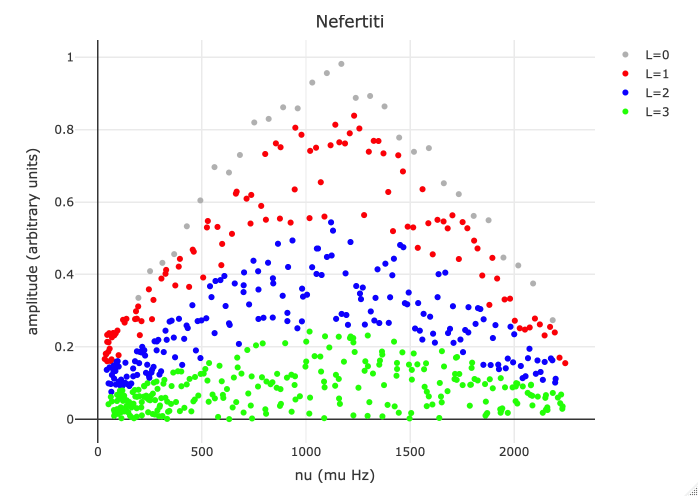

```{r setup, include=FALSE}
knitr::opts_chunk$set(echo = TRUE)
library(plotly)
library(dplyr)
library(Rcpp)
library(RcppArmadillo)

# libraries required
source("~/Dropbox/Boulot/dev/util/RCustomPackages/miscelanea/seismology/readobs_functions.R")
Rcpp::sourceCpp("~/Dropbox/Boulot/dev/util/RCustomPackages/miscelanea/seismology/tools_best.cpp")
# Reading the frequencies

DataPath <- "~/Google\ Drive/Data/models/SoFAR/exercise1"

file_list <- list.files(DataPath, pattern = "*.frq")
file_list_full <- list.files(DataPath, full.names = T)
StarList <- c("Nefertiti", "Sobekneferu", "Hatshepsut")

StarData <- data.frame(Stars = StarList, Files = file_list)
```

### Objective

The main objective of this exercise is to simulate empirical points in an
observational log(gravity)-log(density) diagram.

### Methodolgy

In order to simulate the stars we proceed as follows:

1.  We selected the models from the CEFIRO dataset
2.  We simulated realistic distribution for the amplitudes 
3.  We saved the data in two-columns format (frequency, amplitudes)

#### Step1
We ramdomly selected three models ensuring different
evolutionary stages, metallicity, and surface rotation.
Star names stands for different Pharaos' Queens:

```{r stars, echo=FALSE}
StarData
```
The models can be downloaded from this [link](https://drive.google.com/open?id=1oELmFXSiUJrBqDEYXNI_vbFYscW8UwA9)

#### Step2
Synthethic models' amplitudes where uniformly-random ditributed with the following 
(ad-hoc) weights (ranges within 0 and 1)

```{r weights, echo=FALSE}
data.frame(L0 = "[0.86, 1]", L1 = "[0.56, 8.85]", 
           L2 = "[0.26, 0.55]", L3 = "[0, 0.25]")
```

The whole set of frequency is then apodized by following a gaussian distribution
centered at the middle frequency; in future improvements the centering frequency
should be selected by the user, e.g. to be set around F0.





#### Step3
Synthetic oscillation spectra generated for the three stars are stored in 
three files named upon the star names.

```{r saving, echo=FALSE}
print(paste(StarList, ".dat", sep = ""))
```

