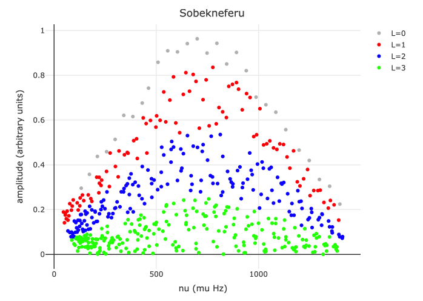
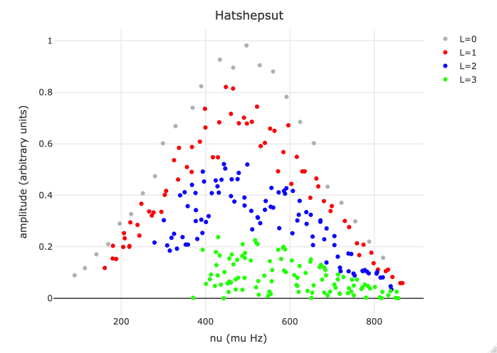

Synthetic A-F stars for SoFAR exercise
================

### Objective

The main objective of this exercise is to simulate empirical points in an observational log(gravity)-log(density) diagram.

### Methodolgy

In order to simulate the stars we proceed as follows:

1.  We selected the models from the CEFIRO dataset
2.  We simulated realistic distribution for the amplitudes
3.  We saved the data in two-columns format (frequency, amplitudes)

#### Step1

We ramdomly selected three models ensuring different evolutionary stages, metallicity, and surface rotation. Star names stands for different Pharaos' Queens:

    ##         Stars                                   Files
    ## 1   Nefertiti   00349-m165fe-3a164o0rotjpzt5p6-ad.frq
    ## 2 Sobekneferu 00589-m180fe-010a164o0rotjpzt5p6-ad.frq
    ## 3  Hatshepsut 00591-m215fe010a164o00rotjpzt5p5-ad.frq

The models can be downloaded from this [link](https://drive.google.com/open?id=1oELmFXSiUJrBqDEYXNI_vbFYscW8UwA9)

#### Step2

Synthethic models' amplitudes where uniformly-random ditributed with the following (ad-hoc) weights (ranges within 0 and 1)

    ##          L0           L1           L2        L3
    ## 1 [0.86, 1] [0.56, 8.85] [0.26, 0.55] [0, 0.25]

The whole set of frequency is then apodized by following a gaussian distribution centered at the middle frequency; in future improvements the centering frequency should be selected by the user, e.g. to be set around F0.

 

#### Step3

Synthetic oscillation spectra generated for the three stars are stored in three files named upon the star names.

    ## [1] "Nefertiti.dat"   "Sobekneferu.dat" "Hatshepsut.dat"
